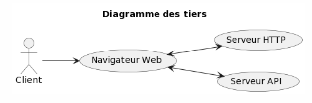
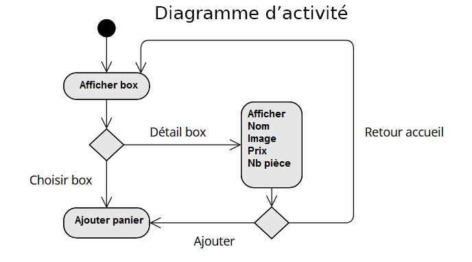
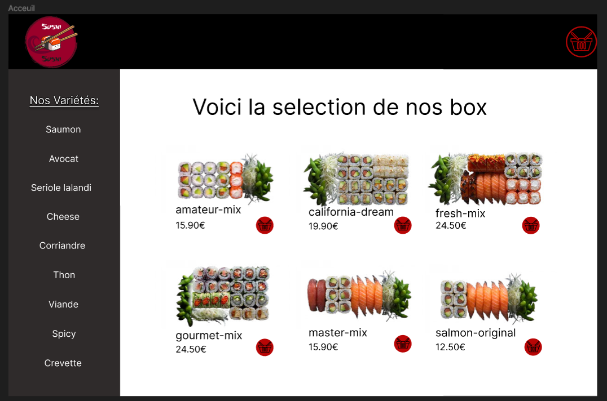
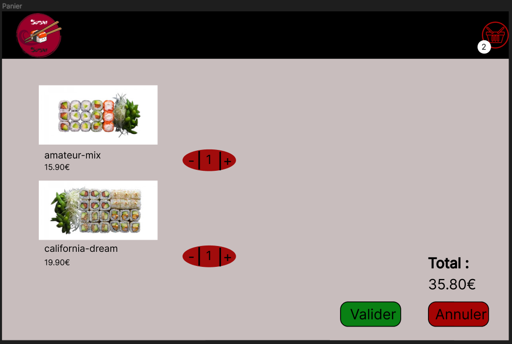
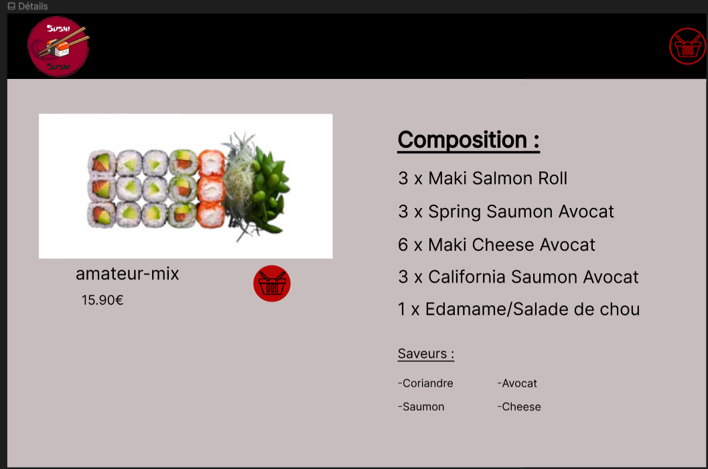

= Sushi
:author: POIRIER Alexandre & BELLIOT Killian
:docdate: 2022-11-21
:asciidoctor-version:1.1
:description: Analyse projet Sushi
:icons: font
:listing-caption: Listing
:toc-title: Table des matières
:toc: left
:toclevels: 4

= Source
Réaliser par l'équipe RedSuns (POIRIER Alexandre & BELLIOT Killian) le 02/04/2023.

Voici d'où vien le projet sushi :

https://ldv-melun.github.io/sio-slam/sio-component/_attachments/SP2-Sushi-Angular-2023.pdf

Voici le lien de notre dépot github :
https://github.com/Naillik77310/Sushi

Voici le lien de la mise en production du site web sushiFast:
https://sushifast-26585.web.app/

== 1. Contexte:
Cette situation professionnelle repose sur le développement d’une application Front-end avec le framework Angular pour une prise de commande au niveau d’un point de vente de sushis (restauration)
Deux scénarios peuvent coexister : l’opérateur prend la commande par téléphone pour une livraison à domicile ou le client utilise une borne de commande. On comprend bien pourquoi, étant une application interne, il n’existe pas d’authentification pour l’instant.
Elle utilisera par ailleurs une application Back-end dans le cadre d’une API présentant la gamme de produits à la vente. On se base sur les SushiBoxes de l’entreprise SushiShop afin d’approcher le plus d’une réalité commerciale.

== 1.1 Les attendus fonctionnels demandés :
L’application Web doit permettre à un utilisateur de passer commande de boxes de sushis en vue
d’établir une commande transmissible à la production (cuisine) Elle comportera :

● L’affichage de la liste des boxes Sushi,

● La possibilité de voir le détail d’une boxe,

● La possibilité de sélectionner une ou plusieurs boxes pour un panier de commande,

● Le calcul du montant de la commande,

● La visualisation des commandes sauvegardées localement, (en test, sans habilitation)

● Une page spécifique concernant la mise en place du RGPD (en prévision d’une commande
par internet)

BTS SIO option SLAM – Lycée Léonard de Vinci - Situation Professionnelle n°2

== 1.2 Les attendus techniques demandés :
1. Prise en main d’une API existante (fournie) via une classe de service dédiée à concevoir

2. Définition des structures des données métier (classes)

3. Sauvegarde du panier côté client (LocalStorage) lors de sa validation par le client.

4. Prise en compte d’au moins deux scénarios malveillants

a. Établir un tableau des actions redoutées
b. Proposer des contres-mesures de scénarios malveillants (Evil User Stories)
5. Tests unitaires - en bonus

== 2. Diagrammes:

=== 2.1 Diagramme des différents tiers de l'application:


=== 2.2 Diagramme de cas d'utilisation pour l'application:

image::src/assets/img/cas-utilisation.png[]

Voici un diagramme d'activité du choix d'une box:




== 3. Maquette:
Voici le lien qui représente la maquette de l'application:
https://www.figma.com/file/jDuWIEKvv1pAiDutf6LeqJ/Untitled?node-id=0%3A1&t=QRdkjubsgVA025tj-1

=== 3.1 Maquette accueil:


=== 3.2 Maquette panier:


=== 3.3 Maquette détails:


== 4. Structure JSON panier

---
```
[
    {
        "id": <l'id de la commande>,
        "prix": <prix total de la commande>,
        "nbTotalBox": <nombre total de box>,
        "articles": [
            {
                "nom": "<nom de la box>",
                "nombre": <quantité de box demandé>
            },
            {
                "nom": "<nom de la box>",
                "nombre": <quantité de box demandé>
            }
        ]
    }
]
```

== 5. Evil User Story

=== 5.1 Evil User Story 1 et contre-mesure 1

En tant que personne malveillante, je veux empêcher l'API de fonctionner en réalisant une attaque par déni de service (DoS et DDoS ) pour ralentir ou arrêter le service pour les autres clients afin de nuire à l'image de marque.

En tant que développeur je bloque ou abandonne les requêtes supplémentaires  afin d'empêcher l'API d'être submergé si plusieurs demandes arrive de plusieurs sources différentes (adresse ip) dans un court laps de temps.

=== 5.2 Evil User Story 2 et contre-mesure 2

En tant que personne malveillante, j'ai découvert que SushiFast utilise AngularJS qui n'est plus pris en charge par Google depuis 2022. Je vais donc me documenter sur les failles d'AngularJS, en vue de les exploiter

En tant que développeur je surveille les mises à jour d'Angular, particulièrement en terme de sécurité (site https://angular.io/), ainsi que les autres composants tiers utilisés par mon projet. Exemple de commandes.
```
ng update @angular/cli @angular/core
```

Pour faire la mise à jour vers la version stable actuel
```
ng update @angular/cli@^<major_version> @angular/core@^<major_version>
```

Pour basculer d'une version majeur à une autre.
```
ng update @angular/cli@^10 @angular/core@^10
```

Permet de prendre la dernière version de 10.xx et l'utiliser pour la mise à jour.

== 6. Diagramme de séquence

=== 6.1 Diagramme de séquence illustrant les échanges réalisés
<<<
[plantuml]
----
@startuml

Client-> ApplicationAngular: connexion à l'application
 ApplicationAngular -> Serveur: connexion au serveur
ApplicationAngular -> API: appel à l'API
HomeComponent -> Client: Affiche page

@enduml
----
== 7. Conclusion

On peut conclure que SushiFast est un projet qui a permis de nous faire monter en compétence avec le frameworks Angular en retraçant tout ce qu'on a vu durant les différents tp précédent dans un projet de commande de Sushi utilisant une API.

